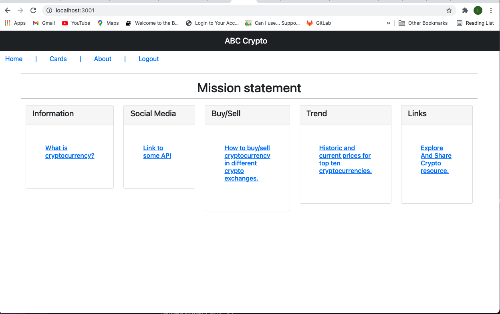

# ABC_Crypto
The team of four seasoned and aspired software developers were inspired by “The Borgen Project” blog article on [“Digital Poverty”](https://borgenproject.org/digital-poverty/) to develop an educational  cryptocurrency app, “ABC Crypto”. “ABC Crypto” is a free app which guides its users to well-known, established resources on cryptocurrencies. The users can learn anything from what cryptocurrencies are, how to buy and sell cryptocurrencies, the latest news on cryptocurrencies, what most popular cryptocurrencies are and its market prices. “ABC Crypto” allows its users to share their own knowledge and resources about cryptocurrencies, vote and comment on the other users’ resources. 

## Getting Started

* clone me, or fork me
* 🌎 live at: [heroku]( https://abc-crypto.herokuapp.com/)

* Screen shot of the deployed app: 
* 

## Deployment
* just deploy, no other actions needed

## Build With 

* [Sequelize ORM](https://sequelize.org/master/identifiers.html)
* [Handlebars](https://handlebarsjs.com/)
* [JavaScript (JS)](https://developer.mozilla.org/en-US/docs/Web/JavaScript)
* [Bootstrap](https://getbootstrap.com/)
* [jQuery](https://jqueryui.com/autocomplete/)
* [CSS](https://developer.mozilla.org/en-US/docs/Web/CSS)
* [Node.js](https://nodejs.dev/learn/writing-files-with-nodejs)

## Authors
* **Nkenge Crowe**
* **Cherry Lam**
* **Nahid M**
* **Irina Pyak**
* **Manzur Shaheed**

## License
This project is licensed under the [MIT](LICENSE.md) license - see the [License.md](LICENSE.md) file for details

## Acknowledgements
* **Instructor of Columbia Engineering Coding Boot Camp** - Ron Erlich
* **Instructor Assistant of Columbia Engineering Coding Boot Camp** - Samuel Thompson
* **Billie Thompson** - *README template* - [PurpleBooth](https://github.com/PurpleBooth)